## 1 - Modifier le formulaire
Pour une modification du formulaire existant, allez sur le lien suivant : 
https://rh.univ-reunion.fr/entretienpro/fr/orbeon/builder/summary?form-version=1

Puis cliquer sur le formulaire correspondant

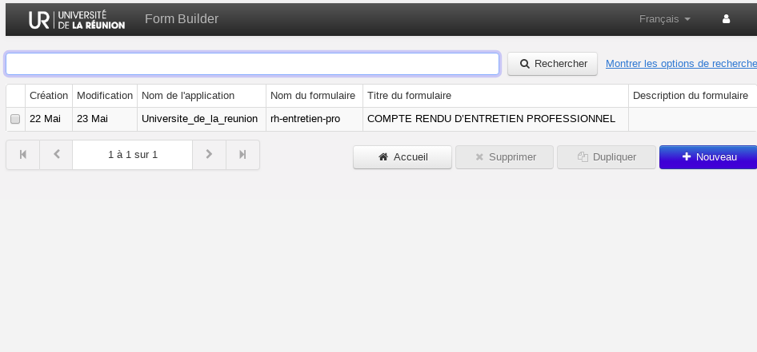

Cliquer sur un champ pour le modifier. 

Pour renommer un champ par exemple, cliquer directement sur la zone où se trouve le texte  (nom du champ). 

Après votre modification, cliquer sur enregistrer (en bas à droite en bleu), puis sur publier (les modifications ne seront pas pris en compte sans avoir cliquer sur "publier")

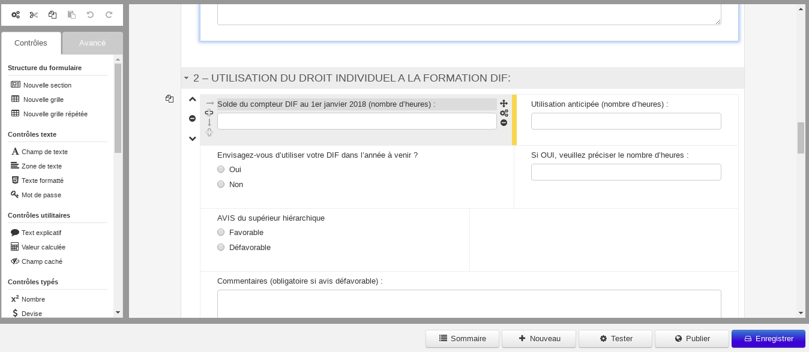

 ## 2 - Administration des formulaires saisies

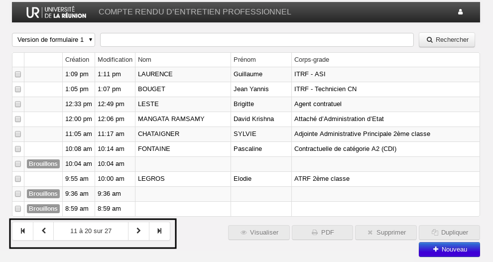

La page ci-dessus est une page que seul l'administrateur peut voir (accès à tous les formulaires générés)
Vous pouvez alors créer, modifier et supprimer (opération définitive) un formulaire. Les utilisateurs 

## 3 - Créer un nouveau formulaire

Pour créer un nouveau formulaire, allez dans : 

https://rh.univ-reunion.fr/entretienpro/fr/orbeon/builder/summary?form-version=1

Cliquez sur nouveau et commencez par donner un nom à votre nouveau formulaire

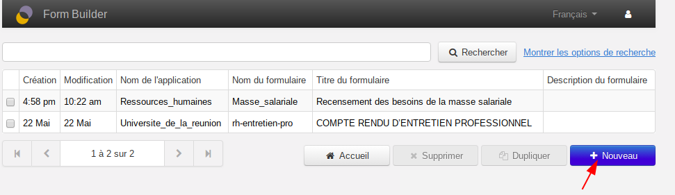

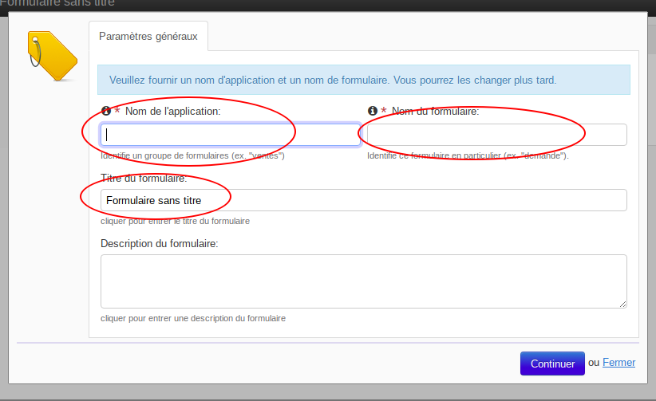

Pour commencer, voici l'interface de travail :

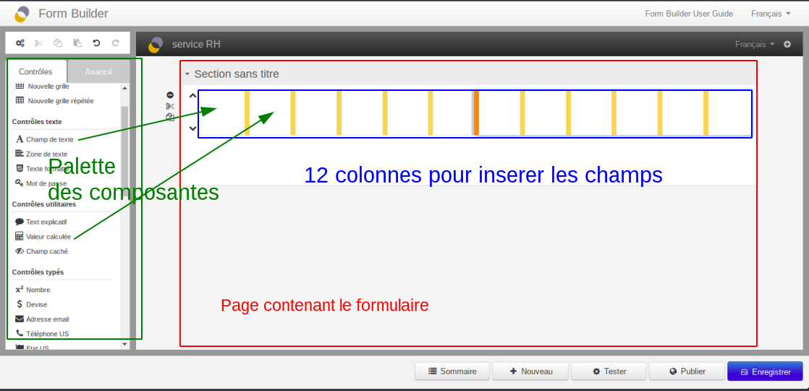

- La zone en rouge correspond à la page à générer
- Cette zone est divisé en 12 colonnes, permettant une design "Responsive" (adapter l'affichage à n'importe taille de l'ecran : tablette, smartphone)
- Tout à gauche vous pouvez trouver les composants disponible pour générer le formulaire. 
Le mécanisme est de trouvez un composant est de le glissez dans une colonne selon votre design. Un composant peut évidement prendre toute la ligne, 3, 6, colonnes, celà dépend de votre design.

Pour donner une bonne structure à votre formulaire, vous pouvez répartir les rubriques en plusieurs section, en peut envisager de générer une nouvelle page pour chaque formulaire par exemple.

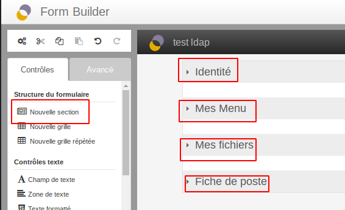

### a - Champ pour les textes :

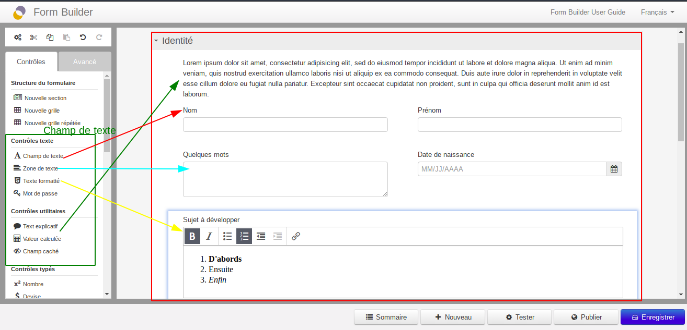

Rapprocher votre curseur à l'extremité droite d'un champ pour afficher les icones de configuration.  
Cliquez sur la zone en rouge montré sur l'image suivant :

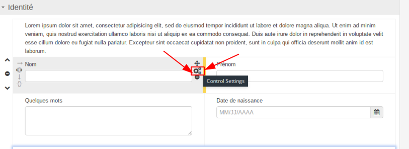

Ici vous allez cochez les cases "Inclure dans la sommaire" et "inclure dans la recherche", puis cliquez sur appuyer  

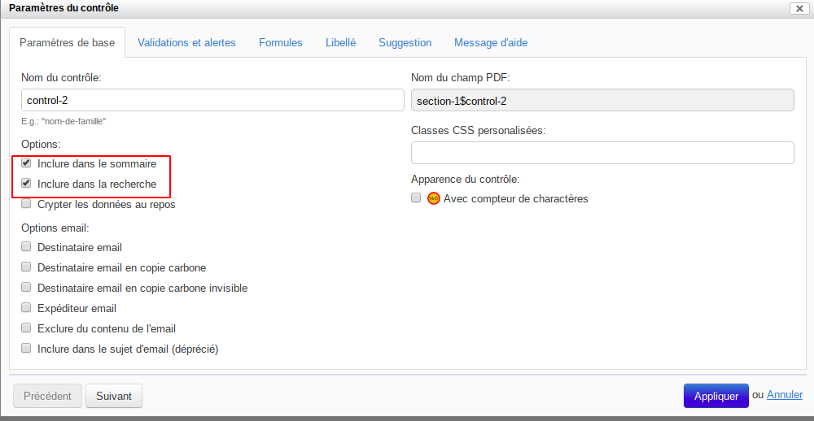

Ce réglage permet d'afficher uniquement aux champs dont vous voulez afficher au sommaire (Nom, Prénom, Fonction, ...).

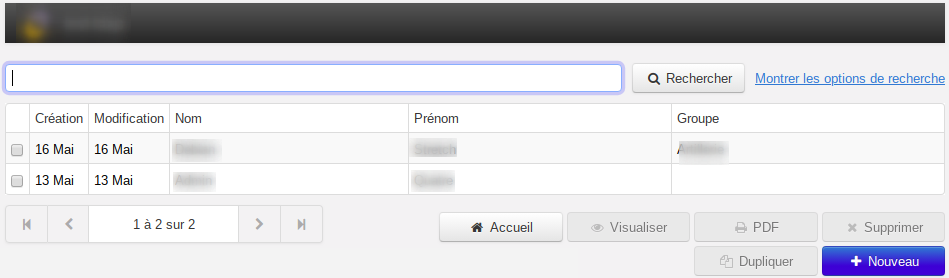

### b - Les champs de selection

Voici les types de menu les plus utilisés courament. 

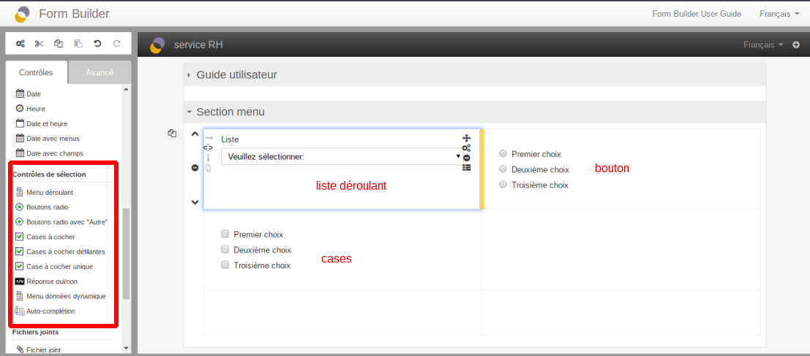

Comme dans les zonnes de textes, rapprocher le curseur vers l'extremité droite du composant, mais cette fois-ci cliquez sur le dernier icône, vous obtiendrez la fenêtre suivante : 

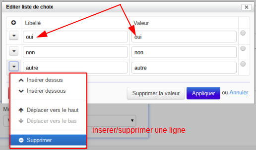

Par défaut, il y a 3 choix, est les valeurs sont :  
- Premier choix <=> 1
- Deuxième choix <=> 2
- Troisième choix <=> 3

Modifiez ces valeurs par votre liste

